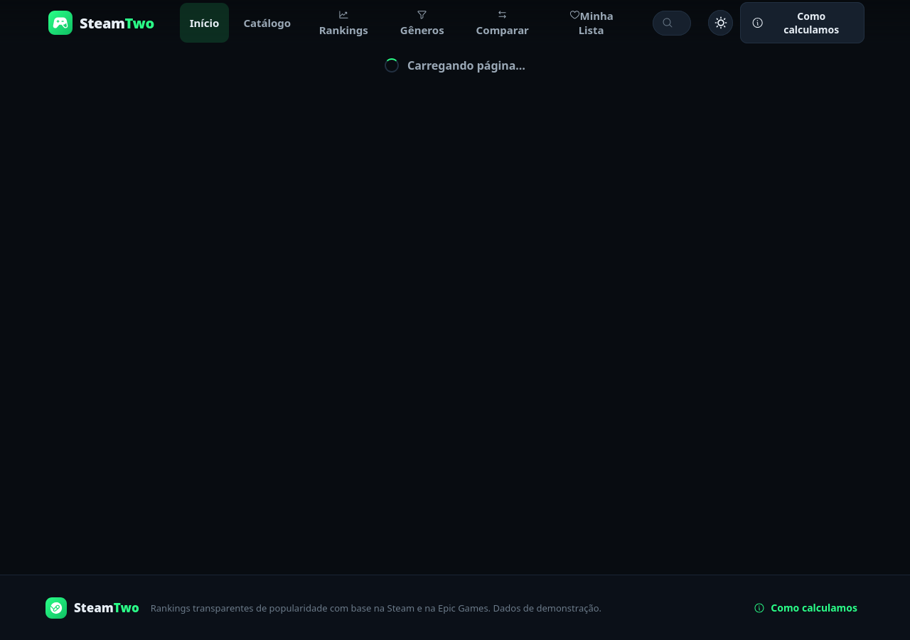

# SteamTwo
### Game analytics · Node.js REST API · PostgreSQL

[Português — detailed project documentation](README.pt-BR.md)

SteamTwo is an academic team project for exploring game rankings, comparing titles and tracking historical metrics. This repository extends an existing codebase; it is a fork of [DavidSilvaProg/steamtwo](https://github.com/DavidSilvaProg/steamtwo).

The portfolio focus is the Express API, relational persistence, database statistics and automated tests.

## Leonardo Cesar da Silva's contributions

| Contribution | Implementation | Evidence |
| --- | --- | --- |
| Database metrics and seed data | `GET /api/stats`, PostgreSQL aggregate queries and `scripts/seed.js` | [c6b1424](https://github.com/Leonardo-backend/steamtwo/commit/c6b1424a8b8856f47f6368ecf7688ff3486c2786) |
| Game comparison | Comparison page and `GET /api/compare?a=...&b=...` | [568cea3](https://github.com/Leonardo-backend/steamtwo/commit/568cea329d42a1143442e896e0fa9175eda1513f) |
| Automated tests | API, domain and integration tests using Vitest, Supertest and pg-mem | [04cb356](https://github.com/Leonardo-backend/steamtwo/commit/04cb3565b81760c9a6fd9b97ecc838a79de0c32e) |
| Search interface | Header search and result preview dropdown | [dbdc261](https://github.com/Leonardo-backend/steamtwo/commit/dbdc2615a138f53170d1ec86ac83bc752f24a28a) |

Team: Douglas Ichiro Iwamoto, Inaiad dos Santos Souza, Raul de Oliveira Silva and Leonardo Cesar da Silva. The contribution table identifies Leonardo's work; the full application is a collaborative project.

## Stack and architecture

| Layer | Technology | Location |
| --- | --- | --- |
| HTTP API | Node.js, JavaScript ES modules, Express 5 | `server/index.js` |
| Database | PostgreSQL 17, node-postgres connection pool | `server/db.js`, `server/persistence.js` |
| Schema and seed | node-pg-migrate, seed script | `migrations/`, `scripts/seed.js` |
| Collection and jobs | Steam data collection and scheduled snapshots | `server/collectors/`, `server/jobs/` |
| UI | React 19, Vite | `src/` |
| Tests | Vitest, Supertest, pg-mem | `tests/` |
| Local database environment | Docker Compose | `docker-compose.yml` |

The application includes fallback data when external sources or the database are unavailable. A working demo does not necessarily mean PostgreSQL is connected or that displayed history is live. Check `/api/health` and `/api/stats` when evaluating the data source.

## Run locally

Use Node.js compatible with the pinned dependencies; Node.js 22.12+ is a suitable baseline for the Vite toolchain. Docker Compose starts **PostgreSQL**, while the API and UI run as separate Node.js processes.

```bash
git clone https://github.com/Leonardo-backend/steamtwo.git
cd steamtwo
npm ci
cp .env.example .env
docker compose up -d
npm run db:migrate
npm run db:seed
```

On Windows, use `Copy-Item .env.example .env` in PowerShell.

In separate terminals:

```bash
npm run dev:api
```

```bash
npm run dev
```

UI: http://127.0.0.1:5173  
API: http://127.0.0.1:3001/api/health

The provided database credentials are for local development. Keep real credentials in an untracked `.env`.

## API overview

| Method | Endpoint | Purpose |
| --- | --- | --- |
| GET | `/api/health` | Service and database status |
| GET | `/api/stats` | Database and catalog metrics |
| GET | `/api/dashboard` | Dashboard data |
| GET | `/api/games?q=&store=&genre=` | Filtered game catalog |
| GET | `/api/search?q=` | Search suggestions |
| GET | `/api/genres` | Genre summaries |
| GET | `/api/games/:slug` | Game details |
| GET | `/api/games/:slug/history` | Historical ranking data |
| GET | `/api/compare?a=&b=` | Comparison between two game slugs |

Example:

```bash
curl "http://127.0.0.1:3001/api/compare?a=elden-ring&b=cyberpunk-2077"
```

## Checks

```bash
npm test
npm run build
npm run test:sites
```

The database integration tests use pg-mem. They complement local PostgreSQL checks; they are not evidence of production deployment or a production database load test.

## Screenshots



[Comparison](screenshots/compare.png) · [Catalog](screenshots/catalog_genres.png) · [Rankings](screenshots/rankings.png)

## Repository guide

- `server/`, `migrations/` and `tests/`: backend review entry points.
- `src/`: UI and API client.
- `screenshots/`: application screenshots.
- `README.pt-BR.md`: preserved Portuguese project description.
- `Relatorio_SteamTwo_Grupo.docx` and `generate_docx.py`: academic report and its generator.
- `design-qa.md`: design review notes.
- `worker/`, `.openai/` and `scripts/prepare-sites-build.mjs`: existing hosting integration.

This is an academic portfolio project. It does not claim commercial users, production-scale traffic or exclusive authorship of the original codebase.
